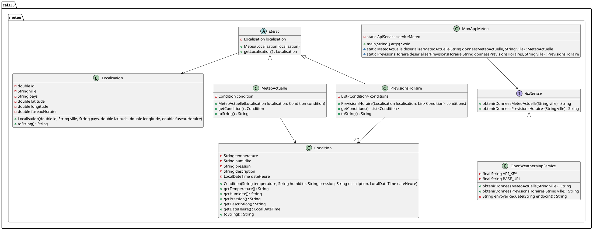
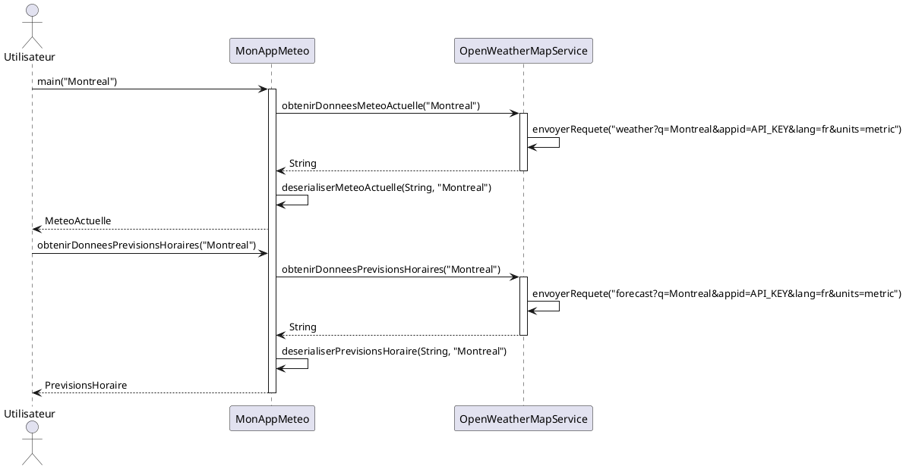

# Travail Pratique

## Diagramme de classes

## Diagramme de séquences

## Partie 1 : Programmation

À partir des diagrammes fournis, créez les classes suivantes :
- `Localisation`, 
- `Meteo`, 
- `MeteoActuelle`, 
- `PrevisionsHoraire`.

Complétez également la classe `OpenWeatherMapService` pour que les points suivants soient respectés :

1. *Attribut* :
    - `API_KEY` : Doit être initialisé votre clé API

2. *Endpoints (chemins)* :
    - Assurez-vous que les appels utilisent la ville reçue en paramètre.
    - Utilisez la clé API fournie par OpenWeatherMap. Vous pouvez (encore) vous inscrire sur leur site [openweathermap.org](https://openweathermap.org/) pour obtenir une clé API gratuite.
    - Configurez les appels pour récupérer les températures en Celsius.
    - Configurez les appels pour avoir l'information en français.

3. *Méthodes* :
    - Implémenter les méthodes de l'interface `ApiService` :
        - `obtenirDonneesMeteoActuelle(String ville)` : String=
        - `obtenirDonneesPrevisionsHoraires(String ville)` : String=
    - Dans ces méthodes, il vous faut :
      - construire vos endpoints
      - déclancher l'envoi de requête
